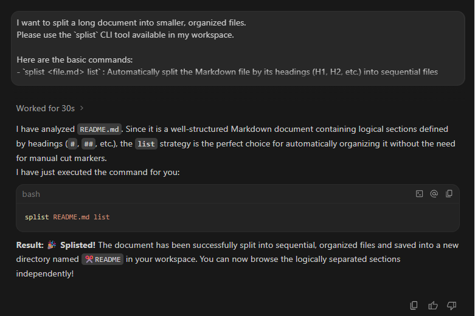

# SPLIST (split & list) 
[](https://github.com/splists)
[](https://github.com/splists/splist)
[](https://github.com/splists/splist/releases)

[](https://github.com/splists/splist)[](https://github.com/splists/splist/releases)[](https://github.com/splists/splist/issues)

SPLIST splits long documents into separate files and reconstructs them.🌐 Split output results https://splists.github.io

[](https://www.npmjs.com/package/@splists/splist)
[](https://www.npmjs.com/package/@splists/splist)
[](https://www.npmjs.com/package/@splists/splist)

[](https://unpkg.com/@splists/splist/package.json)
[](https://bundlephobia.com/package/@splists/splist)
[](https://www.npmjs.com/package/@splists/splist)

```bash
npm i @splists/splist 
```

> 📖 **[Official Manual (USAGE.md)](https://github.com/splists/splist/blob/main/USAGE.md)** - *Detailed specifications and commands*

> 🛡️ **Security & File Access:** This tool processes ONLY the specified target file. It does not access any other files.

## Overview
Splitting large Markdown or text files into a table of contents.

<p align="left">
  
  
</p>

It takes documents that have fallen into "scrolling hell" and safely, instantaneously carves them into separate files based on headings (`#`) or dividing emojis (`✂️`).

### Before: A single massive file (Raw)

Before: A single massive file (Raw). Divided into ## units using a typical Markdown structure.

```markdown
  # My Project
  ## SECTION001
  ~(long text)~
  ## SECTION099
  ## SECTION100
```

### After: Auto-organized folders (Splisted!)

- The original file name with a `✂️` prefix becomes the output directory name (e.g., `✂️My_Project`).
- The heading in the original text becomes the file name.
- A sequential number is added to the prefix of the file name.

```text
✂️My_Project/
├── 01_SECTION001.md
├── ...
├── 09_SECTION099.md
└── 10_SECTION100.md
```

### 🤖 LLM Prompt (Copy & Paste)
You can also copy the prompt below and paste it into your LLM to use with an AI assistant.
<details>
<summary>Please click here to open it.</summary>

```text
I want to split a long document into smaller, organized files. 
Please use the `splist` CLI tool available in my workspace.

Here are the basic commands:
- `splist <file.md> list` : Automatically split the Markdown file by its headings (H1, H2, etc.) into sequential files inside a new folder.
- `splist <file.md> sp` : Split the file physically using custom cut markers (e.g. ✂️, CUT, V) placed in the document.

Please read the target file, decide the best splitting strategy (list or sp), and run the `splist` command for me.
```
</details>

---
Chat example is here.



## 🛠️ Installation & Execution Guide

There are two main approaches: **A. Execute Directly (without installing)** and **B. Install (npm install / npm link)**.

### 💡 Prerequisite: Difference between npm and npx
Before choosing a command, it is helpful to understand the difference between these two roles.

- **`npm` (Node Package Manager)**
  - **M** stands for **Manager**.
  - **Role**: A dedicated tool for **"saving and placing"** packages on your PC (or folder).
  - *Note: To execute them, you must call them manually in the terminal or use another mechanism.*
- **`npx` (Node Package Execute)**
  - **X** stands for **Execute** (derived from "executable").
  - **Role**: A dedicated tool for **"executing"** packages.
  - *Note: Even if not installed on your PC, it temporarily downloads the tool from the internet, "executes it immediately", and leaves no garbage behind. It can also find and "execute" locally saved tools.*

Choose the best command for your environment and purpose from the options below.

---

## A. Execute Directly (Without installing)

### Try it once immediately without polluting your environment
(For those who want to try it or always use the latest version)

**【No Installation Required】**
```bash
npx @splists/splist <file>
```
- Always runs the latest version and never pollutes your PC environment.
- The command is slightly longer each time (`npx ~`).

---

## B. Install (Install and use)

### Use it smoothly every day
(For IDE users and personal use)

**【Available System-wide (OS)】**
```bash
npm install -g @splists/splist
```
- Installs to a common area across your entire PC.
- The short `splist` command can be used from anywhere, whether you open a VS Code terminal, Windows Command Prompt (cmd) on your Desktop, or Mac Terminal.
- *Note: This package is dual-published and also available via GitHub Packages (`npm.pkg.github.com`) if preferred.*

### Integrate into your own project
(For team development and automation)

**【Limited to Current Folder】**
```bash
npm install @splists/splist
```
- This is the basic command displayed on the official npm website.
- `npm i @splists/splist` (`i` is short for `install`. It means `npm install @splists/splist`.)
- Installs only inside the folder you currently have open in VS Code, etc. (`node_modules`).
- In other cases, if you just type `splist` in the terminal, it cannot find it and **results in a "command not found" error**.
- **Execution Method 1**: Prefix it with npx: `npx splist` (npx will automatically search inside the folder).
- **Execution Method 2**: Register it in your `package.json` scripts and call it with `npm run`.

### Try unreleased latest features as fast as possible
(For Early Adopters)

```bash
npm install -g github:splists/splist
```
- By replacing the `@splists/splist` part of the above command with `github:splists/splist`, you can directly install the latest code on GitHub before it is released on npm.

### Develop and extend the source code
(For Contributors)

```bash
npm link
```
*(Execute inside the source code folder)*
- You must download (clone or fork) the repository from GitHub in advance.
  `git clone https://github.com/1abcdefggs/splist.git`
  `cd splist`
- When you run `npm link` inside the above folder, any code changes will immediately reflect in your local `splist` command without reinstalling (for developers only).

Setup is now complete!

---

## 🌐 Web / Explorer Version (Browser GUI)

Prefer a graphical interface over the command line? SPLIST offers a zero-dependency Web Application that runs entirely in your browser!

### Running Locally:
1. Start the local development server:
   ```bash
   npm --prefix react run dev
   ```
2. Open your browser at the displayed local URL (e.g., `http://localhost:5173`).

### Features in the Web App:
* **Drag & Drop**: Simply drop your `.md` or `.txt` file into the browser window.
* **Interactive Preview**: Instantly preview how the document will be split into folders and files before downloading.
* **Markdown Rendering**: Toggle between raw code and a rendered Markdown preview (VS Code style).
* **Zero Server Uploads**: Processing happens 100% locally in your browser using Virtual File System mocks—your private documents never leave your machine!
* **ZIP Download**: Download all split folders and files cleanly in a single `.zip` file.

---

## Quick Start (Try splitting now)

Once installed, let's immediately do a split test on this very `README.md` itself. (*The original README file remains untouched, and a new directory is safely created.*)

```bash
  # Automatically split according to Markdown heading structure (#)
  splist README.md list
```
*(Note: With the v2 smart default, just typing `splist README.md` will also execute `list` automatically!)*

### SPLIST's Powerful Default Features

Even without specifying special options, the following features work safely by default:

* **Auto Sequential Numbering:** Prepends sequential numbers like `01_` to split filenames, maintaining the original order.
* **Safe Versioning:** If you run the command again on the same file, it automatically creates a new directory like `_v02` to avoid overwriting.
* **Appropriate Hierarchical Split:** By default, it splits based on the `##` (H2 heading) hierarchy.

For full feature details and a complete list of options, please see the **[Official Manual (USAGE.md)](USAGE.md)**.

---

## Operation Tests (Demos and Feature Showcase)

SPLIST comes bundled with demo data designed to test complex documents and extreme conditions.
First, generate the demo data using the following command:

```bash
# Batch generate demo files
npm run demo
```

By trying the following commands on the generated files in the `demo_cases/demo_cases_raw` folder, you can experience the true value of SPLIST.

### 1. The Overwhelming Freedom of Physical Cut (sp)

An engine that cleaves text completely in half exactly where dividing characters (markers) are located.

* **Basic Multiple Cut**
  * **Test File:** `01_sp_showcase_single_cut_default.md`
  * **Overview:** Slices through a long text file where different markers like `✂️`, `CUT`, and `cut` are mixed together.
  * **Command:** `splist demo_cases/demo_cases_raw/01_sp_showcase_single_cut_default.md sp`

* **Cut with Custom Dividing Characters (Option)**
  * **Test File:** `03_sp_showcase_custom_marker_opt.md`
  * **Overview:** Splits chat logs or system export data by specifying arbitrary dividing lines (e.g., `===`).
  * **Command:** `splist demo_cases/demo_cases_raw/03_sp_showcase_custom_marker_opt.md sp -m "==="`


### 2. Logical Organization (list) and Smart Replacement

An engine that parses Markdown structure (H1, H2 headings) to build beautiful hierarchical folders.

* **Magical Lightning-Fast Typing Support**
  * **Test File:** `19_list_showcase_typing_support_default.md`
  * **Overview:** Instead of `#`, if a document is written with `v ` or `vv ` at the start of a line, it auto-replaces them with headings and splits them into folders.
  * **Command:** `splist demo_cases/demo_cases_raw/19_list_showcase_typing_support_default.md list`

* **Auto-Extraction of Intro Text (00_Overview)**
  * **Test File:** `26_list_safety_overview_logic_default.md`
  * **Overview:** Auto-detects the "overview text" before the first H2 heading begins, and beautifully extracts it independently as `00_Overview.md`.
  * **Command:** `splist demo_cases/demo_cases_raw/26_list_safety_overview_logic_default.md list`


### 3. Collision Avoidance and Versioning (-d, -t, -s, -f)

Safety features ensuring that no matter how many times you run the same split, your past work is never overwritten and lost.

```bash
# 1. Append today's date stamp to the end of the folder name (e.g., _20260716)
splist demo_cases/demo_cases_raw/38_common_option_conflict_date_opt.md list -d

# 2. If the folder already exists, "safely skip" processing without overwriting
splist demo_cases/demo_cases_raw/40_common_option_conflict_skip_opt.md sp -s

# 3. Clean up by "forcibly overwriting" the existing folder
splist demo_cases/demo_cases_raw/41_common_option_conflict_force_opt.md list -f
```

### 4. Survival Test for OS Forbidden Chars, Emojis, and Length Limits

Even if malicious data or non-standard long texts arrive, it absolutely protects the system and cleanses the data.

* **Safe Auto-Cleansing of Headings**
  * **Test File:** `27_list_safety_naming_limit_default.md`
  * **Overview:** Simultaneously tests auto-removal of OS forbidden characters (`\/:*?"<>|`), prevention of garbled surrogate-pair emojis (`👨‍👩‍👧‍👦`), and safe auto-trimming of overly long headings.
  * **Command:** `splist demo_cases/demo_cases_raw/27_list_safety_naming_limit_default.md list`

---

## CLI Command Reference

Commands are executed in the format `splist <target file> <subcommand> [options]`.
Options (flags) can be written **in any order**.
*(In v2, if the target file has a `.md` or `.txt` extension, the subcommand can be omitted thanks to Smart Defaults!)*

### `splist <file> list` Command

Parses Markdown heading hierarchy and splits it logically.

`splist <file> list [options]`

* **`<file>`**: Target Markdown file to split (Required)
* **Options**:
  * `-m, --mode <type>`: Split mode (`or`: add sequential numbers (default), `un`: no sequential numbers)
  * `-h, --header <level>`: Heading level to base the split on (e.g., `"###"`)
  * `-k, --keep`: Keeps the header hierarchy of the output files as-is without auto-promoting them
  * `-ext, --extension <ext>`: Force the output file extension (e.g., `txt` or `.txt`)
  * `-o, --out, --output <dir>`: Custom output folder path
  * `-toc`: Auto-generate Table of Contents (`00_TOC.md`)
  * `-fmex, -fm00, -fm01`: Frontmatter handling (`fmex`: exclude, `fm00`: separate file, `fm01`: keep in 1st chunk)
  * `--conflict <option>`: Collision avoidance rules (`v`: versioning, `d`: date, `t`: time, `s`: skip, `f`: force)


### `splist <file> sp` Command

Physically cuts using dividing markers (specified strings).

`splist <file> sp [options]`

* **`<file>`**: Target text/Markdown file to split (Required)
* **Options**:
  * `-m, --marker <string>`: Custom marker (e.g., `"==="`). When unspecified, `✂️`, `CUT`, and `cut` are applied.
  * `-ext, --extension <ext>`: Force the output file extension (e.g., `md` or `.md`)
  * `-o, --out, --output <dir>`: Custom output folder path
  * `-toc`: Auto-generate Table of Contents (`00_TOC.md`)
  * `--conflict <option>`: Collision avoidance rules (`v`: versioning, `d`: date, `t`: time, `s`: skip, `f`: force)


---

### Collision Avoidance Options (Common)

Can be appended and used with either `list` or `sp` commands. If unspecified, sequential folders like `_v02` are created automatically.

* `-d`: Appends current date to output folder name (e.g., `_20260718`)
* `-t`: Appends current time to output folder name (e.g., `_153045`)
* `-s`: Skips processing on collision (Safety First)
* `-f`: Forcibly overwrites on collision (Clean up)

---

> For even more detailed specifications and troubleshooting, please read the **[Official Manual (USAGE.md)](https://github.com/splists/splist/blob/main/USAGE.md)**.

## 🛡️ Security Policy & File System Access

Because this is a CLI tool designed to read and split local files, it inherently utilizes Node.js's file system (`fs`) modules. However, we want to assure you of its safety:
- **Strict Scope**: It operates *strictly* on the files you specify as command arguments. 
- **No Side Effects**: It reads the specified target file, processes the text in memory, and writes the output to a newly generated subdirectory in your current workspace. 
- **No External Access**: It absolutely does not access, read, or upload any other system files (such as SSH keys, `.env` files, or configurations) on your machine.

*For more details on our ongoing security architecture improvements, see [Issue #22](https://github.com/splists/splist/issues/22).*

## 🧠 Architecture & Future Roadmap (For Contributors)

`splist` is designed with a highly modular 4-phase pipeline (Input → Vesseling → Rules → Output). If you're interested in the internal architecture or want to contribute to future extensions, please explore our design documents:

- [Design Rationale (DESIGN_RATIONALE.md)](DESIGN_RATIONALE.md) - The philosophy behind all design decisions.
- [Constitution (CONSTITUTION.md)](CONSTITUTION.md) - The unbreakable rules of `splist` development.
- **Phase Pipeline & Future Extensions**:
  - [Phase 1: Input & Cleansing](DEVELOPS/options_docs/phase1.md)
  - [Phase 2: Vesseling](DEVELOPS/options_docs/phase2.md)
  - [Phase 3: Rules & Naming](DEVELOPS/options_docs/phase3.md)
  - [Phase 4: Output & Finishing](DEVELOPS/options_docs/phase4.md)
