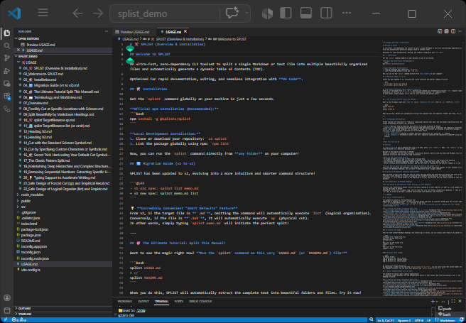
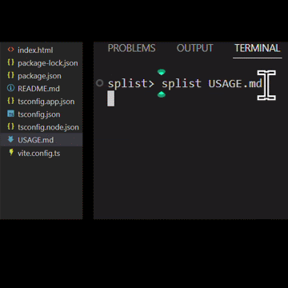

# SPLIST (sp & list)





## Overview
Split massive Markdown and text files into manageable chunks with an auto-generated TOC (Table of Contents). A powerful CLI and local Web GUI utility for text processing.

It takes documents that have fallen into "scrolling hell" and safely, instantaneously carves them into separate files based on headings (`#`) or dividing emojis (`✂️`).

### Before: A single massive file (Raw)
```markdown
  # My Project
  ## SECTION001
  ~(long text)~
  ## SECTION099
  ## SECTION100
```

### After: Auto-organized folders (Splisted!)

```text
My_Project/
├── 001_SECTION001.md
├── ...
├── 099_SECTION099.md
└── 100_SECTION100.md
```

### 🤖 LLM Prompt (Copy & Paste)
Want an AI assistant to help you split a file or organize your workspace using SPLIST? Just copy and paste the prompt below to your LLM:

<details>
<summary>Click to copy the LLM Prompt</summary>

```text
I want to split a long document into smaller, organized files. 
Please use the `splist` CLI tool available in my workspace.

Here are the basic commands:
- `splist <file.md> list` : Automatically split the Markdown file by its headings (H1, H2, etc.) into sequential files inside a new folder.
- `splist <file.md> sp` : Split the file physically using custom cut markers (e.g. ✂️, CUT, V) placed in the document.

Please read the target file, decide the best splitting strategy (list or sp), and run the `splist` command for me.
```
</details>

---

## Installation

The `splist` command becomes globally executable from any directory on your PC. It works across all OS environments: Windows, Mac, and Linux.

1. Open your terminal and navigate to the root folder of the repository:
```bash
cd path/to/splist
```

2. Link (register) the package globally using npm:
```bash
npm link
```

Setup is now complete!

---

## 🌐 Web / Explorer Version (Browser GUI)

Prefer a graphical interface over the command line? SPLIST offers a zero-dependency Web Application that runs entirely in your browser!

### Running Locally:
1. Start the local development server:
   ```bash
   npm --prefix react run dev
   ```
2. Open your browser at the displayed local URL (e.g., `http://localhost:5173`).

### Features in the Web App:
* **Drag & Drop**: Simply drop your `.md` or `.txt` file into the browser window.
* **Interactive Preview**: Instantly preview how the document will be split into folders and files before downloading.
* **Zero Server Uploads**: Processing happens 100% locally in your browser using Virtual File System mocks—your private documents never leave your machine!
* **ZIP Download**: Download all split folders and files cleanly in a single `.zip` file.

---

## Quick Start (Try splitting now)

Once installed, let's immediately do a split test on this very `README.md` itself. (*The original README file remains untouched, and a new directory is safely created.*)

```bash
  # Automatically split according to Markdown heading structure (#)
  splist README.md list
```
*(Note: With the v2 smart default, just typing `splist README.md` will also execute `list` automatically!)*

### SPLIST's Powerful Default Features

Even without specifying special options, the following features work safely by default:

* **Auto Sequential Numbering:** Prepends sequential numbers like `01_` to split filenames, maintaining the original order.
* **Safe Versioning:** If you run the command again on the same file, it automatically creates a new directory like `_v02` to avoid overwriting.
* **Appropriate Hierarchical Split:** By default, it splits based on the `##` (H2 heading) hierarchy.

For full feature details and a complete list of options, please see the **[Official Manual (USAGE.md)](USAGE.md)**.

---

## Operation Tests (Demos and Feature Showcase)

SPLIST comes bundled with demo data designed to test complex documents and extreme conditions.
First, generate the demo data using the following command:

```bash
# Batch generate demo files
npm run demo
```

By trying the following commands on the generated files in the `demo_cases/demo_cases_raw` folder, you can experience the true value of SPLIST.

### 1. The Overwhelming Freedom of Physical Cut (sp)

An engine that cleaves text completely in half exactly where dividing characters (markers) are located.

* **Basic Multiple Cut**
  * **Test File:** `01_sp_showcase_single_cut_default.md`
  * **Overview:** Slices through a long text file where different markers like `✂️`, `CUT`, and `cut` are mixed together.
  * **Command:** `splist demo_cases/demo_cases_raw/01_sp_showcase_single_cut_default.md sp`

* **Cut with Custom Dividing Characters (Option)**
  * **Test File:** `03_sp_showcase_custom_marker_opt.md`
  * **Overview:** Splits chat logs or system export data by specifying arbitrary dividing lines (e.g., `===`).
  * **Command:** `splist demo_cases/demo_cases_raw/03_sp_showcase_custom_marker_opt.md sp -m "==="`


### 2. Logical Organization (list) and Smart Replacement

An engine that parses Markdown structure (H1, H2 headings) to build beautiful hierarchical folders.

* **Magical Lightning-Fast Typing Support**
  * **Test File:** `19_list_showcase_typing_support_default.md`
  * **Overview:** Instead of `#`, if a document is written with `v ` or `vv ` at the start of a line, it auto-replaces them with headings and splits them into folders.
  * **Command:** `splist demo_cases/demo_cases_raw/19_list_showcase_typing_support_default.md list`

* **Auto-Extraction of Intro Text (00_Overview)**
  * **Test File:** `26_list_safety_overview_logic_default.md`
  * **Overview:** Auto-detects the "overview text" before the first H2 heading begins, and beautifully extracts it independently as `00_Overview.md`.
  * **Command:** `splist demo_cases/demo_cases_raw/26_list_safety_overview_logic_default.md list`


### 3. Collision Avoidance and Versioning (-d, -t, -s, -f)

Safety features ensuring that no matter how many times you run the same split, your past work is never overwritten and lost.

```bash
# 1. Append today's date stamp to the end of the folder name (e.g., _20260716)
splist demo_cases/demo_cases_raw/38_common_option_conflict_date_opt.md list -d

# 2. If the folder already exists, "safely skip" processing without overwriting
splist demo_cases/demo_cases_raw/40_common_option_conflict_skip_opt.md sp -s

# 3. Clean up by "forcibly overwriting" the existing folder
splist demo_cases/demo_cases_raw/41_common_option_conflict_force_opt.md list -f
```

### 4. Survival Test for OS Forbidden Chars, Emojis, and Length Limits

Even if malicious data or non-standard long texts arrive, it absolutely protects the system and cleanses the data.

* **Safe Auto-Cleansing of Headings**
  * **Test File:** `27_list_safety_naming_limit_default.md`
  * **Overview:** Simultaneously tests auto-removal of OS forbidden characters (`\/:*?"<>|`), prevention of garbled surrogate-pair emojis (`👨‍👩‍👧‍👦`), and safe auto-trimming of overly long headings.
  * **Command:** `splist demo_cases/demo_cases_raw/27_list_safety_naming_limit_default.md list`

---

## CLI Command Reference

Commands are executed in the format `splist <target file> <subcommand> [options]`.
Options (flags) can be written **in any order**.
*(In v2, if the target file has a `.md` or `.txt` extension, the subcommand can be omitted thanks to Smart Defaults!)*

### `splist <file> list` Command

Parses Markdown heading hierarchy and splits it logically.

`splist <file> list [options]`

* **`<file>`**: Target Markdown file to split (Required)
* **Options**:
  * `-m, --mode <type>`: Split mode (`or`: add sequential numbers (default), `un`: no sequential numbers)
  * `-h, --header <level>`: Heading level to base the split on (e.g., `"###"`)
  * `-k, --keep`: Keeps the header hierarchy of the output files as-is without auto-promoting them
  * `--conflict <option>`: Collision avoidance rules (see Common Options)


### `splist <file> sp` Command

Physically cuts using dividing markers (specified strings).

`splist <file> sp [options]`

* **`<file>`**: Target text/Markdown file to split (Required)
* **Options**:
  * `-m, --marker <string>`: Custom marker (e.g., `"==="`). When unspecified, `✂️`, `CUT`, and `cut` are applied.
  * `--conflict <option>`: Collision avoidance rules (see Common Options)


---

### Collision Avoidance Options (Common)

Can be appended and used with either `list` or `sp` commands. If unspecified, sequential folders like `_v02` are created automatically.

* `-d`: Appends current date to output folder name (e.g., `_20260718`)
* `-t`: Appends current time to output folder name (e.g., `_153045`)
* `-s`: Skips processing on collision (Safety First)
* `-f`: Forcibly overwrites on collision (Clean up)

---

> For even more detailed specifications and troubleshooting, please read the **[Official Manual (USAGE.md)](USAGE.md)**.
